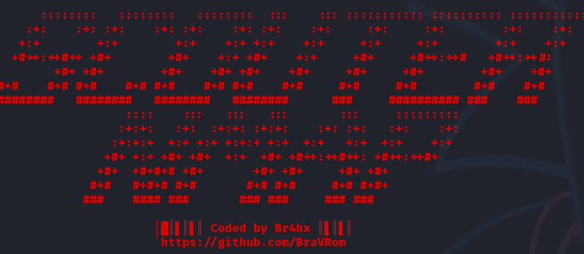

# 🔎 ScouterNmap 🔍  
Escáner automático con Nmap que genera informes visuales

Este script nace con la idea de facilitar la fase de reconocimiento durante una auditoría o análisis de red, automatizando el escaneo de puertos y la detección de servicios mediante `nmap`, y generando un informe en HTML limpio y visual.

---



## 🚀 Características

- Escanea todos los puertos abiertos de una dirección IP o dominio.
- Identifica servicios y versiones asociadas a los puertos detectados.
- Extrae títulos de servicios web si hay puertos HTTP/HTTPS.
- Guarda los resultados en una carpeta con marca temporal para mejor organización.
- Genera un informe en HTML atractivo, legible y listo para compartir.
- Compatible con la mayoría de terminales (uso de `tput` en lugar de códigos ANSI).

## 🛠️ Requisitos

Para utilizar este script, necesitas tener instalados:

- Bash
- nmap

Opcionalmente (pero recomendado):

- Un navegador web para visualizar el informe HTML.

## 📥 Instalación

1. Clona el repositorio:

   ```bash
   git clone https://github.com/BraVRom/ScouterNmap
   cd ScouterNmap

2. Dale permisos de ejecución al script:
chmod +x scouternmap.sh

3. Uso
./scouternmap.sh <IP_o_dominio>

Ejemplo: ./scouternmap.sh scanme.nmap.org

El informe y los resultados se guardarán en una carpeta del tipo resultados-YYYYMMDD-HHMMSS.

🛡️ Uso ético únicamente. Este script es para fines educativos y pruebas de seguridad.
