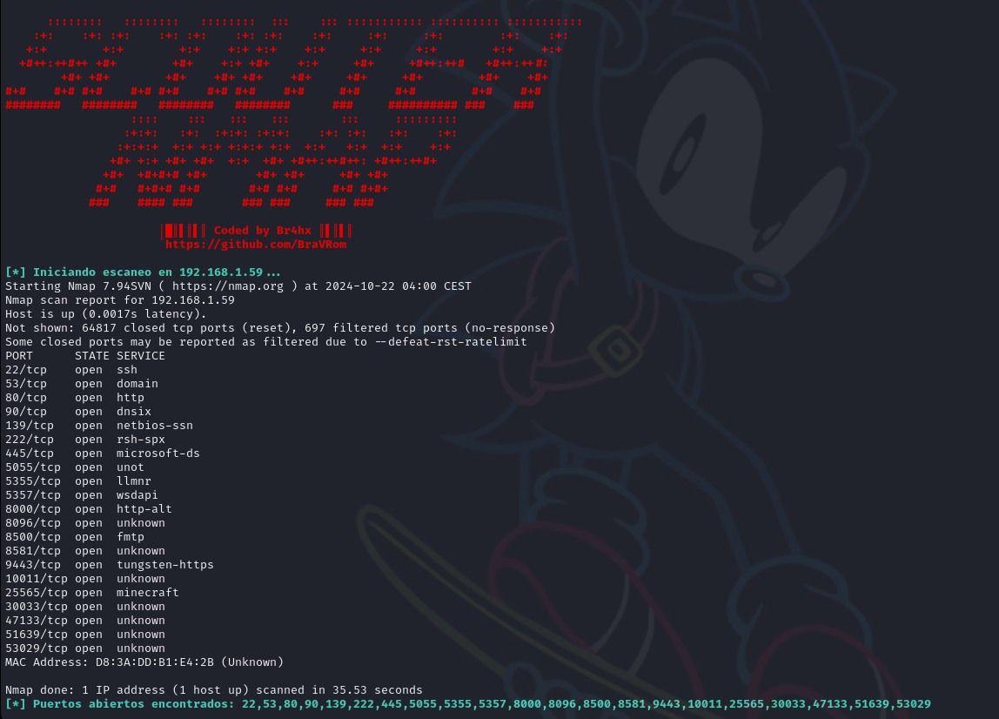

# 🔎 ScouterNmap 🔍
Escáner automático con nmap

Este script se hizo con la idea de automatizar la fase de reconocimiento de puertos abiertos en una dirección IP específica utilizando la herramienta `nmap`.

---


## 🚀 Características

- Escanea todos los puertos abiertos en una dirección IP.
- Realiza un escaneo para identificar los servicios que se ejecutan en los puertos abiertos, con la versión que usa.
- Genera un archivo con los resultados del escaneo.

## 🛠️ Requisitos

Para utilizar este script, hay que tener instalado:

- Bash
- nmap

## 📥 Instalación

1. Clona el repositorio:

   ```bash
   git clone https://github.com/BraVRom/ScouterNmap
   cd ScouterNmap

2. Permiso de ejecución:
   ```bash
   chmod +x scouternmap.sh
   
3. Uso
Para usar el script, ejecuta el siguiente comando con una dirección ip víctima como argumento:
```bash
sudo ./scouternmap.sh <dirección_ip>
```
Reemplaza <dirección_ip> con la dirección IP que deseas escanear.

## 💻 Screenshot

